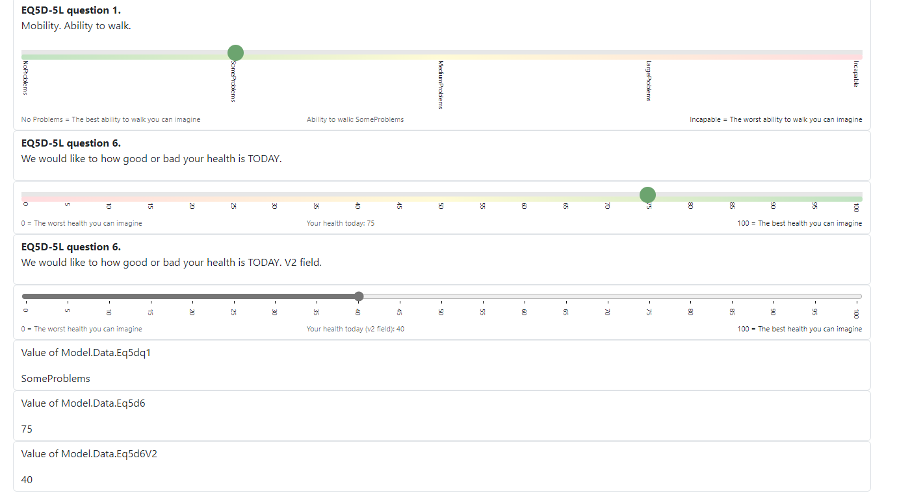

## Blazor lib component

This repository contains Blazor lib **Slider** component that shows an input of type 'range'. 
The slider got default horizontal layout, where the minimum value for the slider is shown to the most left of the scale, which
goes along the x-axis for the slider got towards higher values and the maximum value is the value to the most right. The slider
x-axis goes along the 'slider track'. 

The value of the slider is indicated by the 'slider thumb'.

Below the slider are shown 'tick marks', which are controlled by the **Minimum** and **Maximum** values and **StepSize**.

Note that the supported data types are the data types that are _IConvertible_ and _struct_, and the code expects
types that can be converted to double. You can use integers for example, but also decimals or floats and so on.

In addition, enums can be used, but it works only if your enum got consecutive values, for example
0,1,2,3,4 . The best results are if these consecutive values got the same _StepSize_.

To start using the Blazor slider, add this using in your .razor file where you want to use the component.

<pre>
 <code class='hljs csharp'>
@using BlazorSliderLib
</code>
</pre>

Please note that the slider has been tested using _Bootstrap 5_, more specifically this version:

<code>
	   "bootstrap@5.3.3"
</code>
 
Here is sample markup you can add to test out the Blazor slider (3 sliders are rendered using a custom model and
the updated values are shown in labels below :

<pre>
<code class='hljs html'>
    &lt;div class="container"&gt; 

        &lt;div class="row"&gt;
            &lt;div class="form-control col-md-4"&gt;
                &lt;p&gt;&lt;b&gt;EQ5D-5L question 1.&lt;/b&gt; &lt;br /&gt;Mobility. Ability to walk.&lt;/p&gt;
                &lt;BlazorSliderLib.Slider T="Eq5dWalk" UseAlternateStyle="AlternateStyle.AlternateStyleInverseColorScale" Title="Ability to walk" ValueChanged="@((e) =&gt; UpdateEq5dQ1(e))"
                MinimumDescription="No Problems = The best ability to walk you can imagine" MaximumDescription="Incapable = The worst ability to walk you can imagine" /&gt;
            &lt;/div&gt;
        &lt;/div&gt;

        &lt;div class="row"&gt;
            &lt;div class="form-control col-md-4"&gt;
                &lt;p&gt;&lt;b&gt;EQ5D-5L question 6.&lt;/b&gt; &lt;br /&gt;We would like to how good or bad your health is TODAY.&lt;/p&gt;
            &lt;/div&gt;
        &lt;/div&gt;

        &lt;div class="row"&gt;
            &lt;div class="form-control col-md-4"&gt;
                &lt;BlazorSliderLib.Slider T="int" UseAlternateStyle="AlternateStyle.AlternateStyle" Minimum="0" Maximum="100" @bind-Value="@(Model.Data.Eq5dq6)" Stepsize="5" Title="Your health today"
                MinimumDescription="0 = The worst health you can imagine" MaximumDescription="100 = The best health you can imagine" /&gt;
            &lt;/div&gt;
        &lt;/div&gt;

        &lt;div class="row"&gt;
            &lt;div class="form-control col-md-4"&gt;
                &lt;p&gt;&lt;b&gt;EQ5D-5L question 6.&lt;/b&gt; &lt;br /&gt;We would like to how good or bad your health is TODAY. V2 field.&lt;/p&gt;
            &lt;/div&gt;
        &lt;/div&gt;

        &lt;div class="row"&gt;
            &lt;div class="form-control col-md-4"&gt;
                &lt;BlazorSliderLib.Slider T="int" Minimum="0" Maximum="100" ValueChanged="@((e) =&gt; UpdateEq5dq6V2(e))" Stepsize="5" Title="Your health today (v2 field)"
                MinimumDescription="0 = The worst health you can imagine" MaximumDescription="100 = The best health you can imagine" /&gt;
            &lt;/div&gt;
        &lt;/div&gt;

        &lt;div class="row"&gt;
            &lt;div class="form-control col-md-4"&gt;
                &lt;p&gt;Value of Model.Data.Eq5dq1&lt;/p&gt;
                @Model.Data.Eq5dq1
            &lt;/div&gt;
        &lt;/div&gt;

        &lt;div class="row"&gt;
            &lt;div class="form-control col-md-4"&gt; &lt;p&gt;Value of Model.Data.Eq5d6&lt;/p&gt;
                @Model.Data.Eq5dq6 
            &lt;/div&gt; 
        &lt;/div&gt;

        &lt;div class="row"&gt;
            &lt;div class="form-control col-md-4"&gt;
                &lt;p&gt;Value of Model.Data.Eq5d6V2&lt;/p&gt;
                @Model.Data.Eq5dq6V2
            &lt;/div&gt;
        &lt;/div&gt;

    

</code>
</pre>

## The different setup of sliders

The slider is set up either with an _alternate style_ or using the default styling for sliders, that is, the slider uses 
an input type of 'range' and the default documented styling on Mozilla Developer Network (MDN) to render a Blazor slider.

In addition, it is possible to set up the _alternate style_ to use a _inverted color range_ where higher values will get a 
reddish color and lower values will get a greenish color. The standard _alternate style_ will show greenish colors for higher values.

The following screenshot shows the possible styling that is possible. Note that the default styling is shown in the 
slider at the bottom, which will render a bit different in different browsers. In Chrome for example, the slider will 
render with a bluish color. In Edge Chromium, a grayish color is used for the 'slider tick' and 'slider thumb'. 

Screenshots showing the sliders:

The following parameters can be used:

**Title**

Required. The title is shown below the slider component and centered horizontally
along the center of the x-axis which the slider is oriented.

**Value**

The value of the slider. It can be data bound using either the _@bind-Value_ directive attribute that supports two-way data binding.
You can instead use the @ValueChanged event callback, if desired.

**Minimum**

The minimum value along the slider. It is default set to 0 for numbers. For enums, the lowest value is chosen of the enum (minimum enum alternative, converted to double internally).

**Maximum**

The maximum value along the slider. It is default set to 100 for numbers. For enums, the higheset value is chosen of the enum (maximum enum alternative, converted to double internally).

**Stepsize**

The step size for the slider. It is default set to 5 for numbers. For enums, it is set to 1. (note that internally the slider must use double values to work with the _tickmarks_, which expects double values).

**ShowTickmarks**

Shows tick marks for slider. It is default set to 'true'. Tick marks are generated from the values of _Minimum_, _Maximum_ and _StepSize_ .

**MinimumDescription**

Shows additionally description for the minimum value, shown as a small label below the slider.
It will only be shown in the value is not empty.

**UseAlternateStyle**

If the **UseAlternateStyle** is set to either **AlternateStyle** and **AlternateStyleInverseColorScale** ,
alternate styling is used.

## CSS rules to enable the slider
Actually, it is necessary to define a set of CSS rules to make the slider work.

The slider's css rules are defined in two different files.

### Default CSS rules 
`Slider.css`

The CSS rules below are taken from MDN Mozilla Developer Network page for the input type 'range' control. 

Input type 'range' control MDN article:

<a href='https://developer.mozilla.org/en-US/docs/Web/HTML/Element/input/range'>https://developer.mozilla.org/en-US/docs/Web/HTML/Element/input/range</a>

Additional settings are set up. The width is set to 100% so the slider can get as much horizontal space as possible and 'stretch'. 
There are also basic styles set up for both the tick label and _datalist_.The _datalist_ is the tickmarks for the slider.
The tick marks are automatically generated for the slider.

<pre>
<code class='hljs csharp'>

.sliderv2
{
    width:100%;
}

.sliderv2Label {
    font-weight: 400;
    text-align: center;
    left: 50%;
    font-size:0.7em;
    font-family: -apple-system, BlinkMacSystemFont, "Segoe UI", Roboto, "Helvetica Neue", Arial, margin-bottom: 2px;
}

datalist {
    display: flex;
    flex-direction: column;
    justify-content: space-between;
    writing-mode: vertical-lr;
    width: 100%;
}

.tick-label {

    justify-content: space-between;
    font-size:0.6em;

    top: 20px; /* Adjust this value as needed */
}

input[type="range"] {
    width: 100%;
    margin: 0;
}

</code>
</pre>

## Alternate CSS rules
`SliderAlternate.css`

The alternate CSS rules are setting up additional styling, where color encoding is used for the 
'slider track' where higher values along the 'slider track' get a more 'greenish color', while lower values 
gets 'reddish values'. It is possible to set up the inverse color encoding here, with higher values getting 'reddish color'. 
Lower values gets more 'greenish colors' in this setup.

<pre>
<code class='hljs css'>

.alternate-style input[type="range"] {
    -webkit-appearance: none; /* Remove default styling */
    width: 100%;
    height: 8px;
    background: #ddd;
    outline: none;
    opacity: 0.7;
    transition: opacity .2s;
}

    .alternate-style input[type="range"]:hover {
        opacity: 1;
    }

    .alternate-style input[type="range"]::-webkit-slider-runnable-track {
        width: 100%;
        height: 8px;
        background: linear-gradient(to left, #A5D6A7, #FFF9C4, #FFCDD2); /* More desaturated gradient color */
        border: none;
        border-radius: 3px;
    }

        .alternate-style-inverse-colorscale input[type="range"]::-webkit-slider-runnable-track {
            background: linear-gradient(to right, #A5D6A7, #FFF9C4, #FFCDD2) !important; /* More desaturated gradient color, inverted color range */
        }

.alternate-style input[type="range"]::-webkit-slider-thumb {
    -webkit-appearance: none; /* Remove default styling */
    appearance: none;
    width: 25px;
    height: 25px;
    background: #2E7D32; /* Even darker green thumb color */
    cursor: pointer;
    border-radius: 50%;
    margin-top: -15px !important; /* Move the thumb up */
}

    .alternate-style input[type="range"]::-moz-range-track {
        width: 100%;
        height: 8px;
        background: linear-gradient(to left, #A5D6A7, #FFF9C4, #FFCDD2); /* More desaturated gradient color */
        border: none;
        border-radius: 3px;
    }

        .alternate-style-inverse-colorscale input[type="range"]::-moz-range-track {
            background: linear-gradient(to right, #A5D6A7, #FFF9C4, #FFCDD2 !important; /* More desaturated gradient color, inverted color range */
        }

    .alternate-style input[type="range"]::-moz-range-thumb {
        width: 25px;
        height: 25px;
        background: #2E7D32; /* Even darker green thumb color */
        cursor: pointer;
        border-radius: 50%;
        transform: translateY(-15px); /* Move the thumb up */
    }

</code>
</pre>

The implementation for the Blazor slider looks like this, in the codebehind file for the Slider:

<pre>
<code class='hljs csharp'>

using Microsoft.AspNetCore.Components;

namespace BlazorSliderLib
{

    /// 

    /// Slider to be used in Blazor. Uses input type='range' with HTML5 element datalist and custom css to show a slider.
    /// To add tick marks, set the <see cref="ShowTickmarks"/> to true (this is default)
    /// 

    /// <typeparam name="T"></typeparam>
    public partial class Slider<T> : ComponentBase
        where T : struct, IComparable
    {

        /// 

        /// Initial value to set to the slider, data bound so it can also be read out
        /// 

        [Parameter]
        public T Value { get; set; }

        public double ValueAsDouble { get; set; }

        public double GetValueAsDouble()
        {
            if (typeof(T).IsEnum)
            {
                if (_isInitialized)
                {
                    var e = _enumValues.FirstOrDefault(v => Convert.ToDouble(v).Equals(Convert.ToDouble(Value)));
                    return Convert.ToDouble(Convert.ChangeType(Value, typeof(int)));
                }
                else
                {
                    return 0;
                }
            }
            else
            {
                return Convert.ToDouble(Value);
            }
        }        

        [Parameter, EditorRequired]
        public required string Title { get; set; }

        [Parameter]
        public string? MinimumDescription { get; set; }

        [Parameter]
        public string? MaximumDescription { get; set; }

        [Parameter]
        public double Minimum { get; set; } = typeof(T).IsEnum ? Enum.GetValues(typeof(T)).Cast<int>().Select(e => Convert.ToDouble(e)).Min() : 0.0;

        [Parameter]
        public double Maximum { get; set; } = typeof(T).IsEnum ? Enum.GetValues(typeof(T)).Cast<int>().Select(e => Convert.ToDouble(e)).Max() : 100.0;

        [Parameter]
        public double? Stepsize { get; set; } = typeof(T).IsEnum ? 1 : 5.0;

        [Parameter]
        public bool ShowTickmarks { get; set; } = true;

        [Parameter]
        public AlternateStyle UseAlternateStyle { get; set; } = AlternateStyle.None;

        [Parameter]
        public EventCallback<T> ValueChanged { get; set; }

        public List<double> Tickmarks { get; set; } = new List<double>();

        private List<T> _enumValues { get; set; } = new List<T>();

        private bool _isInitialized = false;

        private async Task OnValueChanged(ChangeEventArgs e)
        {
            if (e.Value == null)
            {
                return;
            }
            if (typeof(T).IsEnum && e.Value != null)
            {
                var enumValue = _enumValues.FirstOrDefault(v => Convert.ToDouble(v).Equals(Convert.ToDouble(e.Value))); 
                if (Enum.TryParse(typeof(T), enumValue.ToString(), out _)) {
                    Value = enumValue; //check that it was a non-null value set from the slider
                }
                else
                {
                    return; //if we cannot handle the enum value set, do not process further
                }
            }
            else
            {
                Value = (T)Convert.ChangeType(e.Value!, typeof(T));
            }

            ValueAsDouble = GetValueAsDouble();

            await ValueChanged.InvokeAsync(Value);
        }

        private string TickmarksId = "ticksmarks_" + Guid.NewGuid().ToString("N");

        protected override async Task OnParametersSetAsync()
        {
            if (_isInitialized)
            {
                return ; //initialize ONCE 
            }

            if (!typeof(T).IsEnum && Value.CompareTo(0) == 0)
            {
                Value = (T)Convert.ChangeType((Convert.ToDouble(Maximum) - Convert.ToDouble(Minimum)) / 2, typeof(T));
                ValueAsDouble = GetValueAsDouble();
            }

            if (Maximum.CompareTo(Minimum) < 1)
            {
                throw new ArgumentException("The value for parameter 'Maximum' is set to a smaller value than {Minimum}");
            }
            GenerateTickMarks();

            BuildEnumValuesListIfRequired();

            _isInitialized = true;

            await Task.CompletedTask;
        }

        private void BuildEnumValuesListIfRequired()
        {
            if (typeof(T).IsEnum)
            {
                foreach (var item in Enum.GetValues(typeof(T)))
                {
                    _enumValues.Add((T)item);
                }
            }
        }

        private void GenerateTickMarks()
        {
            Tickmarks.Clear();
            if (!ShowTickmarks)
            {
                return;
            }
            if (typeof(T).IsEnum)
            {
                int enumValuesCount = Enum.GetValues(typeof(T)).Length;
                double offsetEnum = 0;
                double minDoubleValue = Enum.GetValues(typeof(T)).Cast<int>().Select(e => Convert.ToDouble(e)).Min();
                double maxDoubleValue = Enum.GetValues(typeof(T)).Cast<int>().Select(e => Convert.ToDouble(e)).Max();
                double enumStepSizeCalculated = (maxDoubleValue - minDoubleValue) / enumValuesCount;

                foreach (var enumValue in Enum.GetValues(typeof(T)))
                {
                    Tickmarks.Add(offsetEnum);
                    offsetEnum += Math.Round(enumStepSizeCalculated, 0);
                }
                return;
            }

            for (double i = Convert.ToDouble(Minimum); i <= Convert.ToDouble(Maximum); i += Convert.ToDouble(Stepsize))
            {
                Tickmarks.Add(i);
            }

        }      

    }

    public enum AlternateStyle
    {
        /// 

        /// No alternate style. Uses the ordinary styling for the slider (browser default of input type 'range')
        /// 

        None,

        /// 

        /// Applies alternate style, using in addition to the 'slider track' an additional visual hint with an additional 'slider track' right below that shows a reddish color for lowest parts of the scale to the slider and towards yellow and greenish hues for higher values
        /// The alternate style uses a larger 'slider thumb' and alternate style to the 'slider-track'. The alternate style gives a more interesting look, especially in Microsoft Edge Chromium.
        /// 

        AlternateStyle,

        /// 

        /// Similar in style to the alternate style, but uses the inverse scale for the colors along the slider
        /// 

        AlternateStyleInverseColorScale
    }

}

</code>
</pre>

The markup of the Slider looks like this:

<pre>
<code class='hljs csharp'>

@using Microsoft.AspNetCore.Components.Forms
@using BlazorSliderLib
@typeparam T where T : struct, IComparable

<input type="range" @bind="@ValueAsDouble" min="@Minimum" max="@Maximum" step="@Stepsize" list="@TickmarksId" @oninput="OnValueChanged" />
<datalist id="@TickmarksId">
    @{
        var itemIndex = 0;
    }
    @foreach (var value in Tickmarks){
        if (typeof(T).IsEnum){
            var itemLabel = _enumValues.ElementAt(itemIndex);
            <option class="tick-label" value="@value" label="@itemLabel"></option>
        }
        else {
            <option class="tick-label" value="@value" label="@value"></option>
        }
        itemIndex++;    
    }
</datalist>

@if (!string.IsNullOrWhiteSpace(MinimumDescription)){
    

        <label class="sliderv2Label text-muted">@MinimumDescription</label>
    

}
@if (!string.IsNullOrWhiteSpace(Title)){
    

        <label class="sliderv2Label text-muted" style="text-align:center">@Title: @Value</label>
    

}

@if (!string.IsNullOrWhiteSpace(MaximumDescription)){
    

        <label class="sliderv2Label tet-muted text-end">@MaximumDescription</label>
    

}

<link rel="stylesheet" href="_content/BlazorSliderLib/Slider.css" />
<link rel="stylesheet" href="_content/BlazorSliderLib/SliderAlternate.css" />

<link rel="shortcut icon" type="image/x-icon" href="favicon.ico"/>

</code>
</pre>

___

Last update of Readme docs: 04.01.2025